

  

🇮🇹 &nbsp;<a href="#versione-italiana">Versione italiana</a>

 

### About me

What I enjoy most is taking large, messy, real-world data and finding the patterns that explain what's going on in it.

My thesis is where that shows most clearly. I'm a final-year Computer Science student at the Università degli Studi di Torino, graduating in November 2026. Through a university research project approved by Meta, I work with the Meta Content Library to study how people communicate in Facebook groups during emergencies: how they coordinate and how information spreads from one group to another.

My coursework has followed the same thread: relational database design, statistical analysis at scale, distributed systems, and software engineering methodology. My long-term goal is to specialize technically in data analysis.

 

### Selected projects

  <a href="https://github.com/leofrancu/UniTo-IUM-TWEB-2024-25"></a>
  <a href="https://github.com/leofrancu/UniTo-BD-2023-24"></a>

  <a href="https://github.com/leofrancu/Unito-SAS-2025-26"></a>
  <a href="https://github.com/leofrancu/UniTo-ProgIII-2025-26"></a>

  <a href="https://github.com/leofrancu/UniTo-LFT-2023-24"></a>
  

 



 

---

## Versione italiana

<b>Mostra il profilo in italiano</b>

 

### Chi sono

Quello che mi appassiona di più è prendere dati reali, grandi e disordinati, e trovare i pattern che spiegano cosa sta succedendo.

La mia tesi è dove questo si vede meglio. Sono un laureando in Informatica all'Università degli Studi di Torino e mi laureo a novembre 2026. Grazie a un progetto di ricerca dell'ateneo approvato da Meta, lavoro con la Meta Content Library per studiare come le persone comunicano nei gruppi Facebook durante le emergenze: come si coordinano e come le informazioni si diffondono da un gruppo all'altro.

Il mio percorso universitario ha seguito lo stesso filo: progettazione di database relazionali, analisi statistica su larga scala, sistemi distribuiti e metodologia di ingegneria del software. Il mio obiettivo di lungo periodo è specializzarmi tecnicamente nell'analisi dei dati.

 

### Progetti selezionati

  <a href="https://github.com/leofrancu/UniTo-IUM-TWEB-2024-25"></a>
  <a href="https://github.com/leofrancu/UniTo-BD-2023-24"></a>

  <a href="https://github.com/leofrancu/Unito-SAS-2025-26"></a>
  <a href="https://github.com/leofrancu/UniTo-ProgIII-2025-26"></a>

  <a href="https://github.com/leofrancu/UniTo-LFT-2023-24"></a>
  

 



