

<picture><source media="(prefers-color-scheme: dark)" srcset="assets/banner-dark.svg">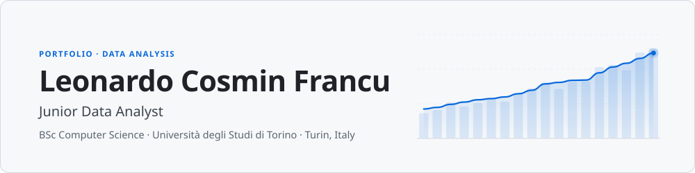</picture>

  

<a href="./CV_Francu_Leonardo_Cosmin.pdf"><picture><source media="(prefers-color-scheme: dark)" srcset="assets/btn-cv-dark.svg"></picture></a>
<a href="https://www.linkedin.com/in/leonardofrancu"><picture><source media="(prefers-color-scheme: dark)" srcset="assets/btn-linkedin-dark.svg"></picture></a>
<a href="mailto:leonardocfrancu@gmail.com"><picture><source media="(prefers-color-scheme: dark)" srcset="assets/btn-email-dark.svg"></picture></a>

 

<b>English</b> &nbsp;·&nbsp; <a href="#versione-italiana">Versione italiana</a>

 

### About me

What I enjoy most is taking large, messy, real-world data and finding the patterns that explain what's going on in it.

My thesis is where that shows most clearly. I'm a final-year Computer Science student at the Università degli Studi di Torino, graduating in November 2026. Through a university research project approved by Meta, I work with the Meta Content Library to study how people communicate in Facebook groups during emergencies: how they coordinate and how information spreads from one group to another.

My coursework has followed the same thread: relational database design, statistical analysis at scale, distributed systems, and software engineering methodology. My long-term goal is to specialize technically in data analysis.

 

<picture><source media="(prefers-color-scheme: dark)" srcset="assets/thesis-en-dark.svg">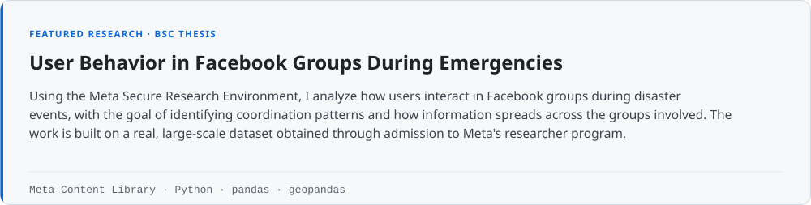</picture>

### Selected projects

<a href="https://github.com/leofrancu/UniTo-IUM-TWEB-2024-25"><picture><source media="(prefers-color-scheme: dark)" srcset="assets/card-ium-tweb-en-dark.svg">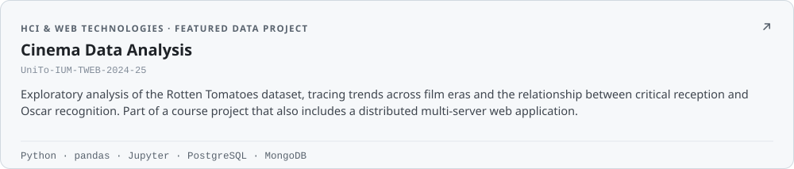</picture></a>

<a href="https://github.com/leofrancu/UniTo-BD-2023-24"><picture><source media="(prefers-color-scheme: dark)" srcset="assets/card-bd-en-dark.svg">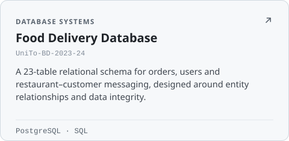</picture></a>
<a href="https://github.com/leofrancu/Unito-SAS-2025-26"><picture><source media="(prefers-color-scheme: dark)" srcset="assets/card-sas-en-dark.svg">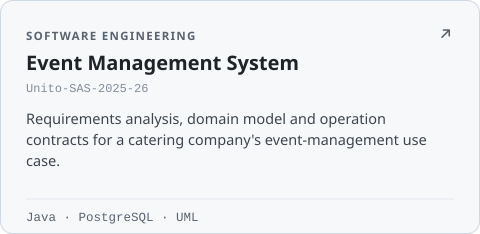</picture></a>

<a href="https://github.com/leofrancu/UniTo-ProgIII-2025-26"><picture><source media="(prefers-color-scheme: dark)" srcset="assets/card-prog3-en-dark.svg">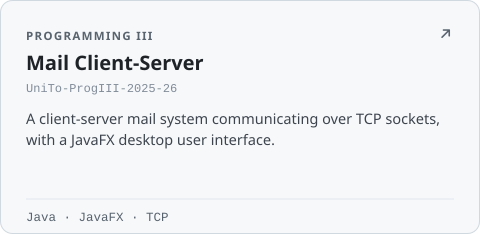</picture></a>
<a href="https://github.com/leofrancu/UniTo-LFT-2023-24"><picture><source media="(prefers-color-scheme: dark)" srcset="assets/card-lft-en-dark.svg">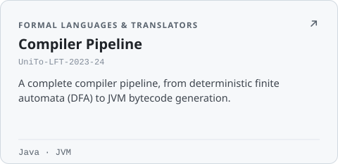</picture></a>

<picture><source media="(prefers-color-scheme: dark)" srcset="assets/card-asd-en-dark.svg">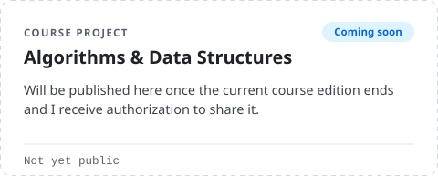</picture>
<picture><source media="(prefers-color-scheme: dark)" srcset="assets/card-so-en-dark.svg">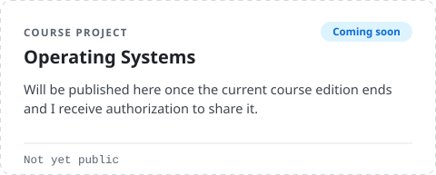</picture>

 

<picture><source media="(prefers-color-scheme: dark)" srcset="assets/skills-en-dark.svg">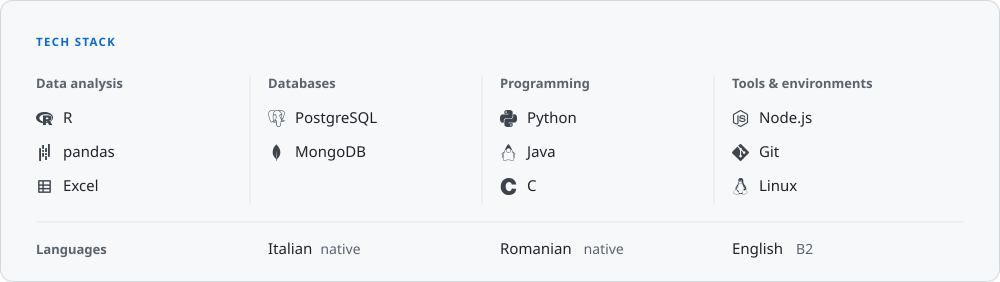</picture>

 

<picture><source media="(prefers-color-scheme: dark)" srcset="assets/education-en-dark.svg">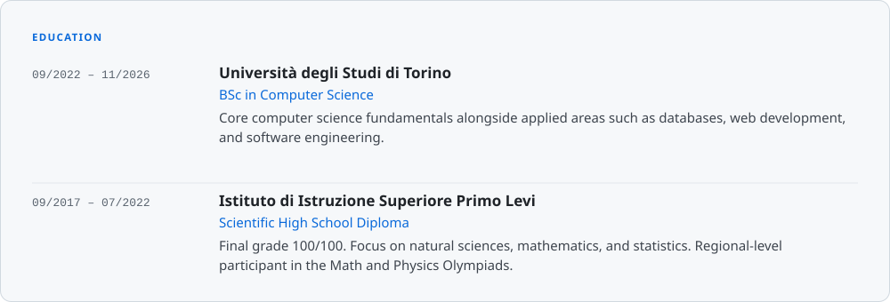</picture>

 

## Versione italiana

<b>Mostra il profilo in italiano</b>

 

### Chi sono

Quello che mi appassiona di più è prendere dati reali, grandi e disordinati, e trovare i pattern che spiegano cosa sta succedendo.

La mia tesi è dove questo si vede meglio. Sono un laureando in Informatica all'Università degli Studi di Torino e mi laureo a novembre 2026. Grazie a un progetto di ricerca dell'ateneo approvato da Meta, lavoro con la Meta Content Library per studiare come le persone comunicano nei gruppi Facebook durante le emergenze: come si coordinano e come le informazioni si diffondono da un gruppo all'altro.

Il mio percorso universitario ha seguito lo stesso filo: progettazione di database relazionali, analisi statistica su larga scala, sistemi distribuiti e metodologia di ingegneria del software. Il mio obiettivo di lungo periodo è specializzarmi tecnicamente nell'analisi dei dati.

 

<picture><source media="(prefers-color-scheme: dark)" srcset="assets/thesis-it-dark.svg">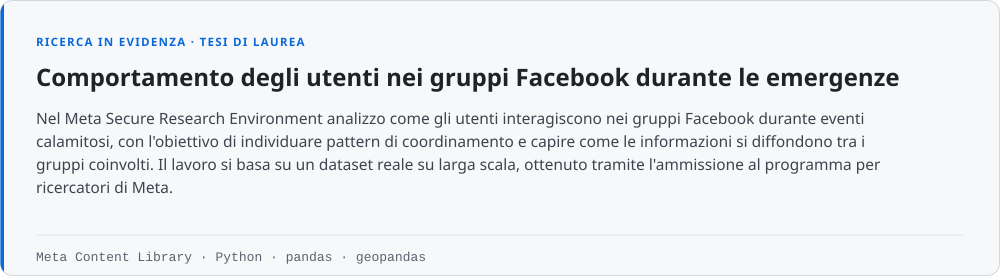</picture>

### Progetti selezionati

<a href="https://github.com/leofrancu/UniTo-IUM-TWEB-2024-25"><picture><source media="(prefers-color-scheme: dark)" srcset="assets/card-ium-tweb-it-dark.svg">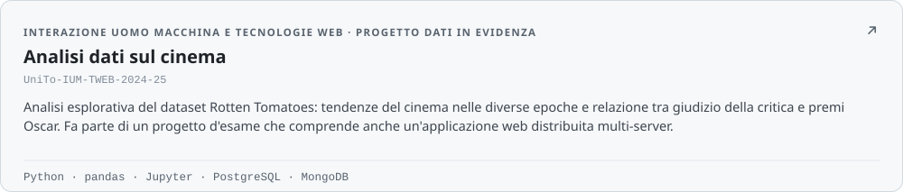</picture></a>

<a href="https://github.com/leofrancu/UniTo-BD-2023-24"><picture><source media="(prefers-color-scheme: dark)" srcset="assets/card-bd-it-dark.svg">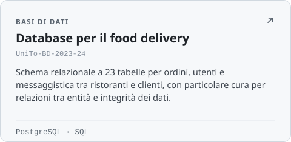</picture></a>
<a href="https://github.com/leofrancu/Unito-SAS-2025-26"><picture><source media="(prefers-color-scheme: dark)" srcset="assets/card-sas-it-dark.svg">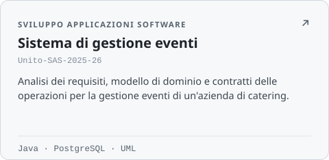</picture></a>

<a href="https://github.com/leofrancu/UniTo-ProgIII-2025-26"><picture><source media="(prefers-color-scheme: dark)" srcset="assets/card-prog3-it-dark.svg">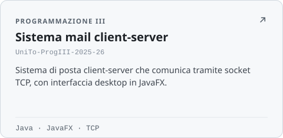</picture></a>
<a href="https://github.com/leofrancu/UniTo-LFT-2023-24"><picture><source media="(prefers-color-scheme: dark)" srcset="assets/card-lft-it-dark.svg">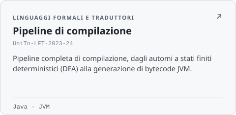</picture></a>

<picture><source media="(prefers-color-scheme: dark)" srcset="assets/card-asd-it-dark.svg">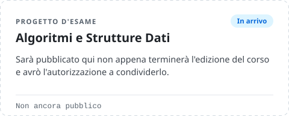</picture>
<picture><source media="(prefers-color-scheme: dark)" srcset="assets/card-so-it-dark.svg">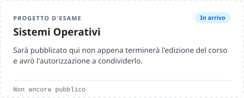</picture>

 

<picture><source media="(prefers-color-scheme: dark)" srcset="assets/skills-it-dark.svg">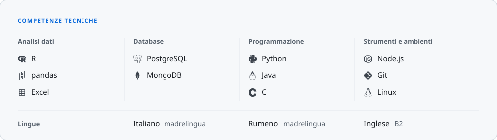</picture>

 

<picture><source media="(prefers-color-scheme: dark)" srcset="assets/education-it-dark.svg">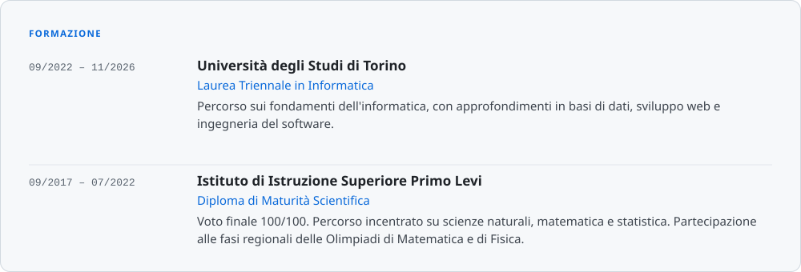</picture>

